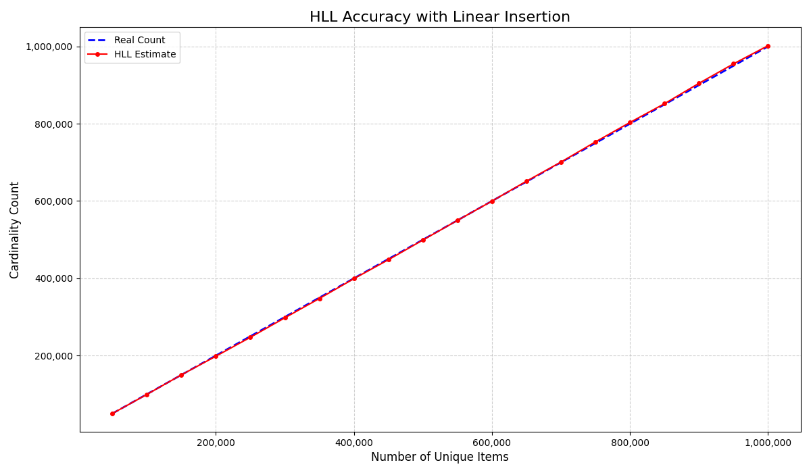
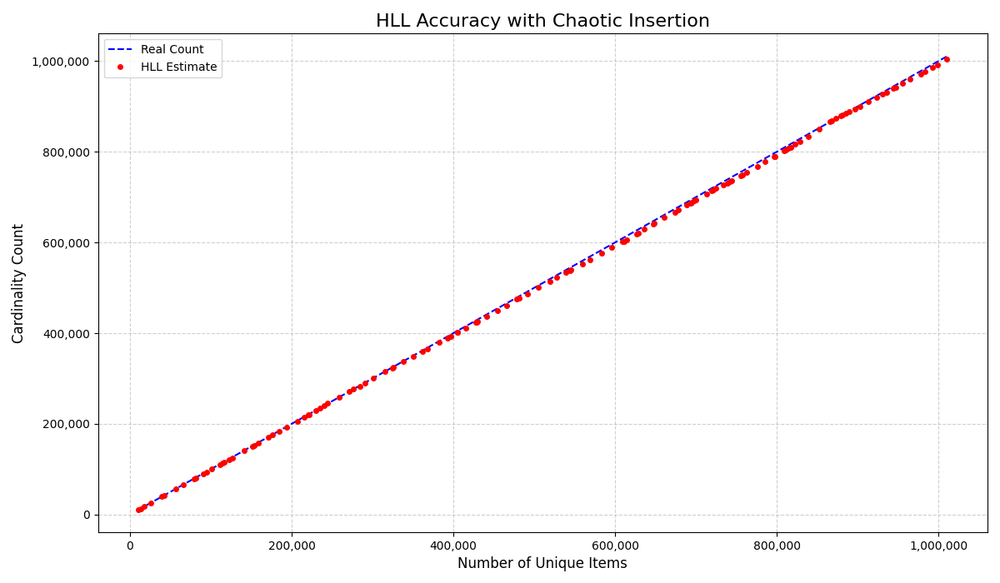
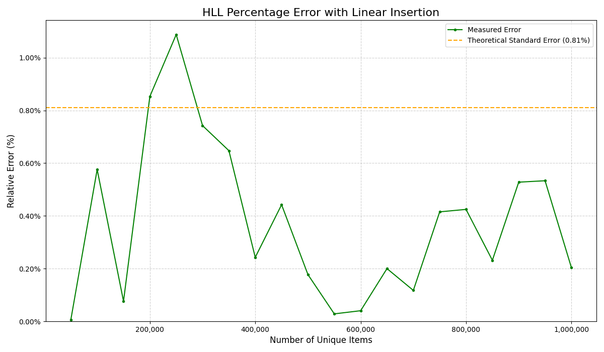
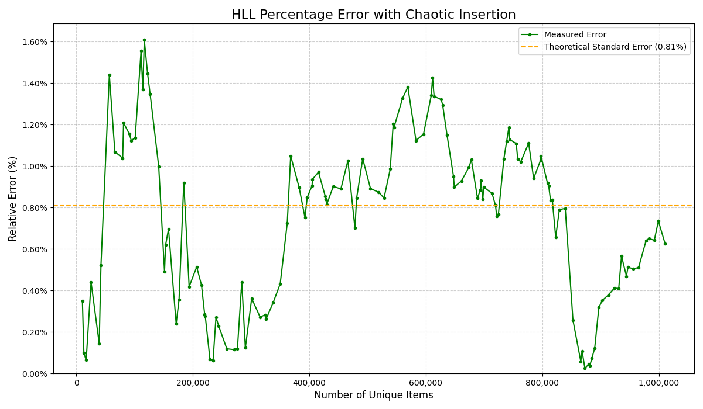

# Redis HyperLogLog Accuracy Analysis

This project provides a visual demonstration of the accuracy and error characteristics of the Redis HyperLogLog data structure. It includes two distinct Python scripts to test HLL performance under different data insertion patterns: linear and chaotic.

The entire environment, including the Redis instance, is managed via Docker for a clean, reproducible setup.

## Key Features

-   **Two Test Scenarios**: Compare HLL performance with predictable, linear data versus chaotic, random data bursts.
-   **Visual Charts**: Automatically generates charts for both accuracy (Real Count vs. HLL Estimate) and error trends.
-   **Dockerized Environment**: Uses a Docker container for Redis, ensuring a simple and isolated setup without needing a local installation.
-   **Realistic Simulation**: The chaotic test uses random UUIDs and variable batch sizes to mimic real-world scenarios like traffic spikes.

## Gallery of Results

The scripts will generate the following visual comparisons:

| Linear Insertion | Chaotic Insertion |
| :---: | :---: |
|  |  |
| *Accuracy remains high with sequential data.* | *Accuracy holds even with random data bursts.* |
|  |  |
| *The error quickly stabilizes below the theoretical limit.* | *The error is more volatile but stays within statistical bounds.* |

## Prerequisites

-   [Docker](https://docs.docker.com/get-docker/)
-   [Python 3.8+](https://www.python.org/downloads/)
-   [Git](https://git-scm.com/downloads/)

## How to Run

**1. Clone the repository**

```bash
git clone <your-repository-url>
cd <repository-name>
```

**2. Start the Redis Container**

This command will download the official Redis image and run it in the background.

```bash
docker run --name redis-hll -p 6379:6379 -d redis
```
You can check if it's running with `docker ps`.

**3. Set up the Python Environment**

It is recommended to use a virtual environment.

```bash
# Create a virtual environment
python3 -m venv .venv

# Activate it (macOS/Linux)
source .venv/bin/activate
# On Windows, use: .venv\Scripts\activate

# Install the required libraries
pip install -r requirements.txt
```

**4. Run the Analysis Scripts**

You can run either script. Each will generate two charts and save them as `.png` files.

```bash
# Run the test with sequential, ordered data
python linear.py

# Run the test with random data and insertion patterns
python chaotic.py
```

## Cleaning Up

When you are finished, you can stop and remove the Docker container.

```bash
docker stop redis-hll
docker rm redis-hll
```